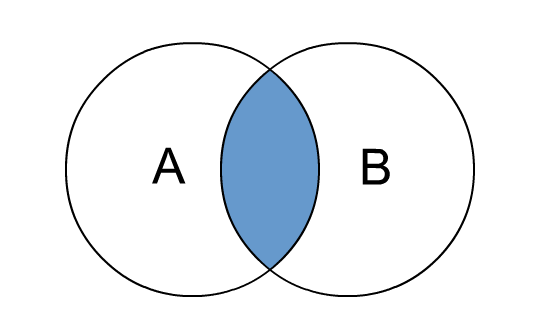
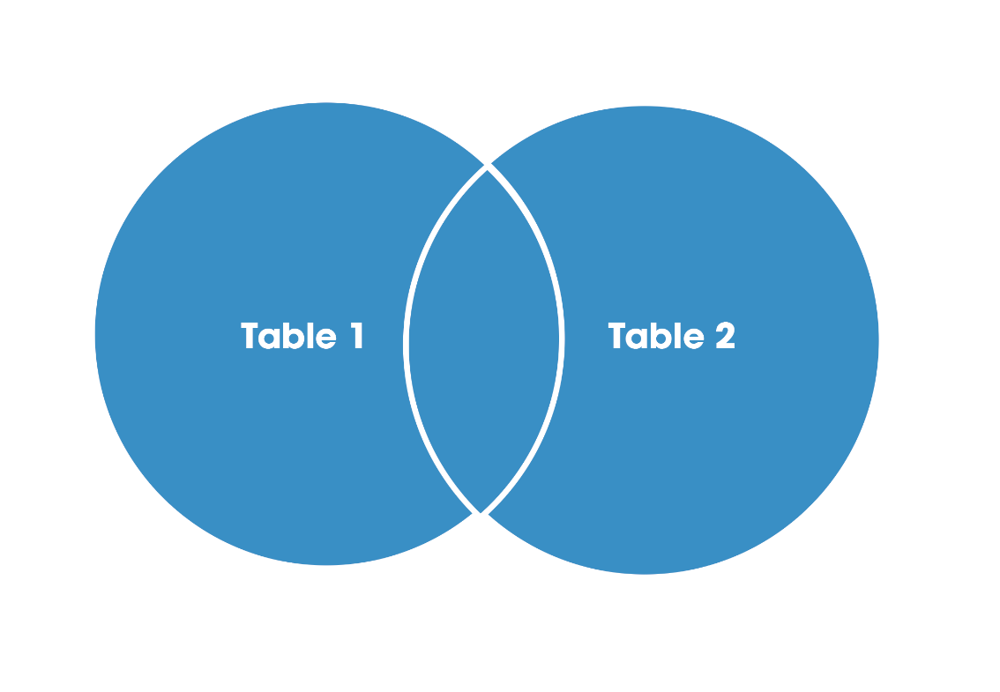
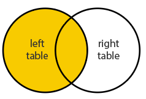
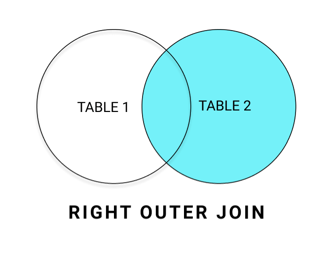

# JOINS

JOINs allow us to combine multiple tables together. The main reason for the different JOIN types is to decide how to deal with information only present in one of the joined tables.

## AS Clause

Aliases can be used in other parts of the query, such as in the SELECT clause, to provide more meaningful names or simplify expressions.

Basic syntax:
``` sql
SELECT column_name AS new_name FROM table_name
```

### Application
Table Name: ***example***
|   fname   |  age  |
|-----------|-------|
|   Alice   |   25  |
|   Bob     |   30  |
|   Charlie |   22  |
|   David   |   28  |
|   Emily   |   35  |

``` sql
SELECT fname AS customer_name, age AS customer_age FROM example
```
| customer_name | customer_age |
|---------------|--------------|
| Alice         | 25           |
| Bob           | 30           |
| Charlie       | 22           |
| David         | 28           |
| Emily         | 35           |

**Note:**  The use of aliases is not allowed directly within the WHERE, GROUP BY etc. clauses in SQL. For example, the WHERE clause is processed before the SELECT clause. The AS operator gets executed at the very end of a query.

``` sql
SELECT fname AS customer_name, age AS customer_age FROM example WHERE customer_age > 28
```
This query would result in an error because ***customer_age*** is not recognized in the WHERE clause.

## INNER JOIN

An inner join is a type of SQL join that combines rows from two or more tables based on a related column between them. The result set includes only the rows where there is a match between the specified columns in both tables.

Basic syntax:
``` sql
SELECT * FROM TableA INNER JOIN TableB ON TableA.col_match = TableB.col_match
```

<p align="left">
  
</p>

### Application
Table Name: ***TableA***
| id  | fname   | lname    |
|-----|---------|----------|
| 1   | John    | Doe      |
| 2   | Alice   | Smith    |
| 3   | Bob     | Johnson  |
| 4   | Eve     | Williams |
| 5   | Charlie | Brown    |

Table Name: ***TableB***
| id  | fname   | address      |
|-----|---------|--------------|
| 1   | Alice   | 456 Oak St   |
| 2   | John    | 123 Main St  |
| 3   | Charlie | 654 Birch St |
| 4   | David   | 789 Pine St  |
| 5   | Eve     | 987 Elm St   |


To find matching names in both TableA and TableB:
``` sql
SELECT * FROM TableA INNER JOIN TableB ON TableA.fname = TableB.fname;
``` 
| id | fname  | lname    | id | fname  | address      |
|----|--------|----------|----|--------|--------------|
| 1  | John   | Doe      | 2  | John   | 123 Main St  |
| 2  | Alice  | Smith    | 1  | Alice  | 456 Oak St   |
| 4  | Eve    | Williams | 5  | Eve    | 987 Elm St   |
| 5  | Charlie| Brown    | 3  | Charlie| 654 Birch St |


**Note:** The aliasing (AS id_A, AS fname_A, AS id_B, AS fname_B) helps distinguish between the columns with the same name from different tables.

**Note:** When a column name is unique within a table, there is no need to explicitly reference the table name when querying that column. 

``` sql
SELECT TableA.id AS id_A,
       TableA.fname AS fname_A,
       lname,
       TableB.id AS id_B,
       TableB.fname AS fname_B,
       address
FROM TableA
INNER JOIN TableB ON TableA.fname = TableB.fname;
```
| id_A | fname_A | lname    | id_B | fname_B | address      |
|------|---------|----------|------|---------|--------------|
| 1    | John    | Doe      | 2    | John    | 123 Main St  |
| 2    | Alice   | Smith    | 1    | Alice   | 456 Oak St   |
| 4    | Eve     | Williams | 5    | Eve     | 987 Elm St   |
| 5    | Charlie | Brown    | 3    | Charlie | 654 Birch St |


**Note:** Remember that table order won’t matter in an INNER JOIN. Also if you see just JOIN without the INNER, PostgreSQL will treat it as an INNER JOIN.

## FULL OUTER JOIN

A full outer joins in SQL retrieves records from multiple tables, including unmatched rows. Unlike inner joins that only return matched rows, full outer joins fill in the gaps with NULL values for columns without corresponding matches.

Basic syntax:
``` sql
SELECT * FROM TableA FULL OUTER JOIN TableB ON TableA.column = TableB.column;
```

<p align="left">
  
</p>

### Application
Table Name: ***TableA***
| id  | fname   | lname    |
|-----|---------|----------|
| 1   | John    | Doe      |
| 2   | Alice   | Smith    |
| 3   | Bob     | Johnson  |
| 4   | Eve     | Williams |
| 5   | Chris   | Brown    |

Table Name: ***TableB***
| id  | fname   | address      |
|-----|---------|--------------|
| 1   | Adam    | 456 Oak St   |
| 2   | John    | 123 Main St  |
| 3   | Charlie | 654 Birch St |
| 4   | David   | 789 Pine St  |
| 5   | Eve     | 987 Elm St   |

To get all rows from both tables, including unmatched ones with NULLs:
``` sql
SELECT * FROM TableA FULL OUTER JOIN TableB ON TableA.fname = TableB.fname
```
| id   | fname   | lname    | id   | fname   | address      |
|------|---------|----------|------|---------|--------------|
| 1    | John    | Doe      | 2    | John    | 123 Main St  |
| 2    | Alice   | Smith    | null | null    | null         |
| 3    | Bob     | Johnson  | null | null    | null         |
| 4    | Eve     | Williams | 5    | Eve     | 987 Elm St   |
| 5    | Chris   | Brown    | null | null    | null         |
| null | null    | null     | 1    | Adam    | 456 Oak St   |
| null | null    | null     | 3    | Charlie | 654 Birch St |
| null | null    | null     | 4    | David   | 789 Pine St  |

To get rows unique to either table(rows not found in both tables):
``` sql
SELECT * FROM TableA FULL OUTER JOIN TableB ON TableA.fname = TableB.fname
WHERE TableA.id IS null OR TableB.id IS null
```
| id  | fname | lname    | id  | fname   | address      |
|-----|-------|----------|-----|---------|--------------|
| 2   | Alice | Smith    | null| null    | null         |
| 3   | Bob   | Johnson  | null| null    | null         |
| 5   | Chris | Brown    | null| null    | null         |
| null| null  | null     | 1   | Adam    | 456 Oak St   |
| null| null  | null     | 3   | Charlie | 654 Birch St |
| null| null  | null     | 4   | David   | 789 Pine St  |

If the "id" column in TableA is null, it means that this particular row is unique to TableB. Conversely, if the "id" column in TableB is null, it means that this particular row is unique to TableA. 

## LEFT OUTER JOIN

A LEFT OUTER JOIN is a type of SQL join that retrieves all records from the left table and the matched records from the right table. If there is no match in the right table, NULL values are returned for columns from that table. 

Basic syntax:
``` sql
SELECT * FROM TableA LEFT OUTER JOIN TableB ON TableA.column = TableB.column;
```

<p align="left">
  
</p>

**Note:** The order of tables is important in a LEFT OUTER JOIN.

### Application
Table Name: ***TableA***
| id  | fname   | lname    |
|-----|---------|----------|
| 1   | John    | Doe      |
| 2   | Alice   | Smith    |
| 3   | Bob     | Johnson  |
| 4   | Eve     | Williams |
| 5   | Chris   | Brown    |

Table Name: ***TableB***
| id  | fname   | address      |
|-----|---------|--------------|
| 1   | Adam    | 456 Oak St   |
| 2   | John    | 123 Main St  |
| 3   | Charlie | 654 Birch St |
| 4   | David   | 789 Pine St  |
| 5   | Eve     | 987 Elm St   |

``` sql
SELECT * FROM TableA LEFT OUTER JOIN TableB ON TableA.fname = TableB.fname;
```
| id   | fname   | lname    | id   | fname   | address      |
|------|---------|----------|------|---------|--------------|
| 1    | John    | Doe      | 2    | John    | 123 Main St  |
| 2    | Alice   | Smith    | null | null    | null         |
| 3    | Bob     | Johnson  | null | null    | null         |
| 4    | Eve     | Williams | 5    | Eve     | 987 Elm St   |
| 5    | Chris   | Brown    | null | null    | null         |

To get rows unique to left table(rows not found in right table):
``` sql
SELECT * FROM TableA LEFT OUTER JOIN TableB ON TableA.fname = TableB.fname WHERE TableB.id IS null;
```

## RIGHT OUTER JOIN

A RIGHT OUTER JOIN is a type of SQL join that retrieves all records from the right table and the matched records from the left table. If there is no match in the left table, NULL values are returned for columns from that table. 

Basic syntax:
```sql
SELECT * FROM TableA RIGHT OUTER JOIN TableB ON TableA.column = TableB.column;
```

<p align="left">
  
</p>

### Application
Table Name: ***TableA***
| id  | fname   | lname    |
|-----|---------|----------|
| 1   | John    | Doe      |
| 2   | Alice   | Smith    |
| 3   | Bob     | Johnson  |
| 4   | Eve     | Williams |
| 5   | Chris   | Brown    |

Table Name: ***TableB***
| id  | fname   | address      |
|-----|---------|--------------|
| 1   | Adam    | 456 Oak St   |
| 2   | John    | 123 Main St  |
| 3   | Charlie | 654 Birch St |
| 4   | David   | 789 Pine St  |
| 5   | Eve     | 987 Elm St   |

```sql
SELECT * FROM TableA RIGHT OUTER JOIN TableB ON TableA.fname = TableB.fname;
```
| id   | fname   | lname    | id   | fname   | address      |
|------|---------|----------|------|---------|--------------|
| 1    | John    | Doe      | 2    | John    | 123 Main St  |
| 4    | Eve     | Williams | 5    | Eve     | 987 Elm St   |
| null | null    | null     | 1    | Adam    | 456 Oak St   |
| null | null    | null     | 3    | Charlie | 654 Birch St |
| null | null    | null     | 4    | David   | 789 Pine St  |

## UNION